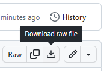
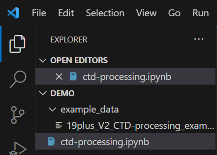
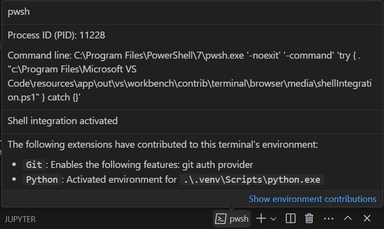
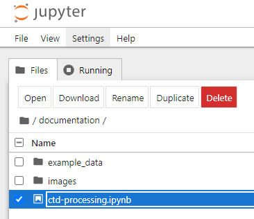
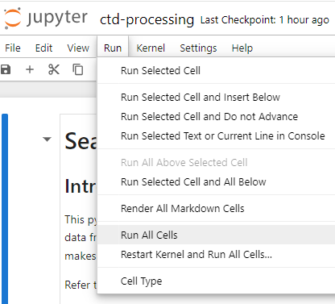

# seabirdscientific
This is the repository for the Sea-Bird Scientific Community Toolkit. It is a collection of:
- Python code to assist in user developed processing of data collected using Sea-Bird instruments
- Example Sea-Bird instrument data
- A jupyter notebook that documents the current toolkit processing options that can be applied to data collected using Sea-Bird SeaCAT and MicroCAT CTDs.

## Installation
The seabirdscientific package is designed to run on Python 3.9 or greater. To install it run the following command:
``` bash
py -m pip install seabirdscientific
```
for windows or
``` bash
pip install seabirdscientific
```
for conda.
### Example use within python code
```python
import sbs
from sbs.process import contour
import sbs.visualize as viz
```

## Jupyter Notebook Setup
### Related Software
Prior to setup, you may wish to install one or more of the following:
1. [Python](https://www.python.org/downloads/) version 3.9 or higher
1. [Git](https://www.git-scm.com/downloads) 
1. [Git GUI clients](https://www.git-scm.com/downloads/guis)
1. [Anaconda](https://docs.anaconda.com/free/anaconda/install/index.html) or [Miniconda](https://docs.conda.io/projects/miniconda/en/latest/miniconda-install.html)
1. [Visual Studio Code](https://code.visualstudio.com/)
    1. Install and start VSCode
    1. Type Ctl-Shift-X to open the extension manager
       1. Ensure that the Python extension from Microsoft is installed 
       1. Ensure that the Jupyter extension from Microsoft is installed

### Setup using seabirdscientific from PyPi using VSCode
If you have [VSCode](https://code.visualstudio.com/), [Python](https://www.python.org/downloads) or [Anaconda](https://docs.anaconda.com/free/anaconda/install/index.html) already installed on your computer:
<!-- TODO: try the follwing once repo is public to replace the following three steps -->
<!-- 1. Download from DownGit link https://minhaskamal.github.io/DownGit/#/home?url=https://github.com/Sea-BirdScientific/seabirdscientific/tree/main/documentation -->
<!-- TODO: change dev to main in following URLs when published -->
1. Download the [ctd-processing.ipynb](https://github.com/Sea-BirdScientific/seabirdscientific/blob/dev/documentation/ctd-processing.ipynb) notebook from github into a new folder. See the image below for the download icon location.

    <kbd></kbd>

1. Open the new folder in VSCode.
1. Create an example_data sub-folder in the new folder.
1. Download [19plus_V2_CTD-processing_example.hex](https://github.com/Sea-BirdScientific/seabirdscientific/blob/dev/documentation/example_data/19plus_V2_CTD-processing_example.hex) from GitHub into the newly created example_data folder. See the image below for the how the new files appear in VSCode with a parent folder named Demo.

    <kbd></kbd>

1. Use the [VS Code - Creating Environments](https://code.visualstudio.com/docs/python/environments#_creating-environments) page as a guide to setup a virtual environment for your work. 
    - Use the .venv environment if solely using Python
    - Use the .conda environment if using Anaconda or Miniconda
1. Open a VSCode power shell terminal if one is not currently active.
1. Ensure that the virtual environment is active by hovering over the terminal tab and checking for the __Python: Activated environment__ extension (see below).

    <kbd></kbd>

1. If the virtual environment does not appear to be running type ```Ctl```+```Shift```+```P``` and run the command ```Developer:Reload Window```
1. Execute the appropriate command below in the powershell terminal to install the toolkit and its dependencies
    <!-- 
    Todo: once published, change below to just ... install seabirdscientific 
    -->
    - For a .venv envronment:
    ``` bash
    py -m pip install seabirdscientific --extra-index-url http://winbuilder02.sbs.ewqg.com/SBSPyPi/ --trusted-host winbuilder02.sbs.ewqg.com
    ```
    - For a .conda environment:
    ``` bash
    pip install seabirdscientific --extra-index-url http://winbuilder02.sbs.ewqg.com/SBSPyPi/ --trusted-host winbuilder02.sbs.ewqg.com
    ```
    If your .conda virtual environment does not include pip, you may need to install it using the command ```conda install pip```.

1. Open the ctd-processing.ipynp notebook in VSCode and run the cells to see the notebook in action. If prompted to choose a kernel source, select the Python Environments... option and then the virtual environment that was just created.

### Setup using a Git Checkout of the Toolkit Repository using VSCode
If you have [VSCode](https://code.visualstudio.com/), [Git](https://www.git-scm.com/downloads) and [Python](https://www.python.org/downloads/) or [Anaconda](https://docs.anaconda.com/free/anaconda/install/index.html) or [Miniconda](https://docs.conda.io/projects/miniconda/en/latest/miniconda-install.html) already installed on your computer:
1. Checkout the [Sea-Bird Scientific](https://github.com/Sea-BirdScientific/seabirdscientific.git) repository from GitHub using a Git GUI Client or one of the following command line methods:
    - To place the toolkit in a folder named seabirdscientific:
        1. At a command prompt, change to the parent directory of where you would like the toolkit to reside.
        1. Run the command ```git clone https://github.com/Sea-BirdScientific/seabirdscientific.git```
    - To place the toolkit in a folder with a different name:
        1. At a command prompt, change to the parent directory of where you would like the toolkit to reside.
        1. Run the command ```git clone https://github.com/Sea-BirdScientific/seabirdscientific.git yourFolderName```
1. Run VSCode and choose File | Open Folder. 
1. Use the file picker to select the toolkit folder that was just created.
1. Use the [VS Code - Creating Environments](https://code.visualstudio.com/docs/python/environments#_creating-environments) page as a guide to setup a virtual environment for your work. 
    - Use the .venv environment if solely using Python
    - Use the .conda environment if using Anaconda or Miniconda
1. Open a VSCode power shell terminal if one is not currently active.
1. Ensure that the virtual environment is active by hovering over the terminal tab and checking for the __Python: Activated environment__ extension (see below).

    <kbd></kbd>

1. If the virtual environment does not appear to be running type ```Ctl```+```Shift```+```P``` and run the command ```Developer:Reload Window```
1. Execute the appropriate command below in the powershell terminal to install the toolkit and its dependencies
    - For a .venv envronment:
    ``` bash
    py -m pip install -e .[dev]
    ```
    - For a .conda environment:
    ``` bash
    pip install -e .[dev]
    ```
    If your .conda virtual environment does not include pip, you may need to install it using the command ```conda install pip```.

1. Open the file documentation/ctd-processing.ipynp notebook in VSCode and run the cells to see the notebook in action. If prompted to choose a kernel source, select the Python Environments... option and then the virtual environment that was just created.
    
### Setup the Notebook Using a Git Checkout of the Toolkit Repository and the Jupyter Web Browser Interface
If you have [Git](https://www.git-scm.com/downloads) and [Python](https://www.python.org/downloads/) or [Anaconda](https://docs.anaconda.com/free/anaconda/install/index.html) or [Miniconda](https://docs.conda.io/projects/miniconda/en/latest/miniconda-install.html) already installed on your computer:
1. Checkout the [Sea-Bird Scientific](https://github.com/Sea-BirdScientific/seabirdscientific.git) repository from GitHub using a Git GUI Client or one of the following command line methods:
    - To place the toolkit in a folder named seabirdscientific:
        1. At a command prompt, change to the parent directory of where you would like the toolkit to reside.
        1. Run the command ```git clone https://github.com/Sea-BirdScientific/seabirdscientific.git```
    - To place the toolkit in a folder with a different name:
        1. At a command prompt, change to the parent directory of where you would like the toolkit to reside.
        1. Run the command ```git clone https://github.com/Sea-BirdScientific/seabirdscientific.git yourFolderName```
1. Create a conda or python virtual environment
    - If using python, at a command prompt run ```python -m venv folderPath``` where folderPath is the location for the new virtual environment.
    - If using conda, at a command prompt run ```conda create -p folderPath python=3.9``` where folderPath is the location for the new virtual environment.
1. Using the instance of Python.exe installed in the new virtual environment, execute the command ```python -m pip install -e .[dev]``` to install the notebook's depencencies into the virtual environment
1. Change the directory in the command terminal to the directory created in step 1.
1. Using the instance of Python.exe installed in the new virtual environment, execute the command ```python -m notebook``` to start the Jupyter web browser server. This should launch the Jupyter web interface ```http://localhost:8888/tree``` in your browser. Leave the command terminal running while accessing the web interface.
1. In the Jupyter web interface, select the ctd-processing.ipynp notebook file in the the documentation folder and select the __Open__ button.

    <kbd></kbd>

1. A new web page will open with the notebook loaded. Select the __Run | Run All Cells__ menu option to run all the cells to see the notebook in action.

    <kbd></kbd>

